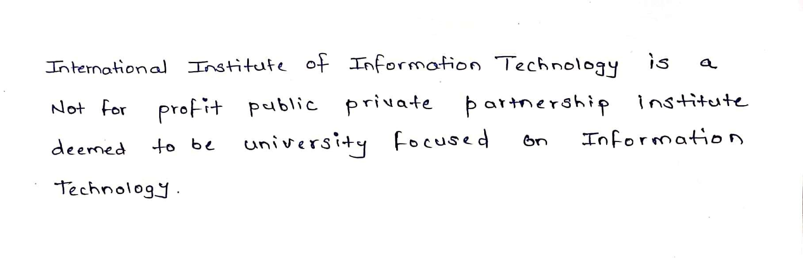
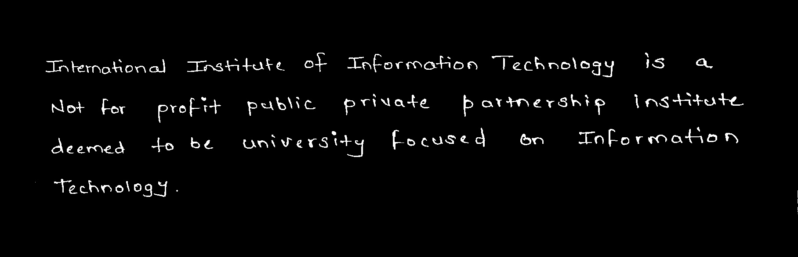
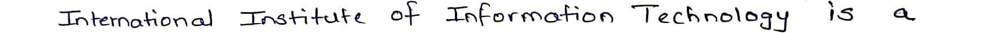
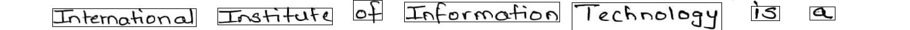

## Smart Notes ##
Handwritten Notes converter from image of handwritten text to text file built using Neural network and Computer vision for image segmentation
 
 Project is mainly divided in  parts:
 
 1.Image preprocessing
 2.Line segmentation
 3.Word segmetation
 4.Model training and validation based on words images from IAM dataset
 5.Recognizing words using pretrained Model and Combining output to output.txt

 <b>Image preprocessing:</b> 
Image processing like resizing image, smoothing, binarization is done in this step.
 

 

 <b>Line Segmentation:</b> 
In this step the entire image is segmented into line such that one image corresponds to one line. 

 

 <b>Word Segmentation:</b> 
In this one by one each line is segmented into words such that one image corresponds to one word. 

 

 <b>Model Training and Validation:</b> 
 <b>1.IAM dataset</b>: 
It consist of large number of handwritten words images in two files : words.tgz(actual images), words.txt(ground truth) using this dataset as input model is trained.
 
 <b>2.Model Configuration</b>: 
It consists of 5 CNN layers, 2 RNN (LSTM) layers and the CTC loss and decoding layer. The illustration below gives an overview of the NN (green: operations, pink: data flowing through NN) and here follows a short description:
The input image is a gray-value image and has a size of 128x32
5 CNN layers map the input image to a feature sequence of size 32x256
2 LSTM layers with 256 units propagate information through the sequence and map the sequence to a matrix of size 32x80. Each matrix-element represents a score for one of the 80 characters at one of the 32 time-steps
The CTC layer either calculates the loss value given the matrix and the ground-truth text (when training), or it decodes the matrix to the final text with best path decoding or beam search decoding (when inferring)
Batch size is set to 50 

 <b>Recognizing words using pretrained Model and Combining output to output.txt</b> 
In this step words are recognized using pretrained model and appended to output.txt line by line.
